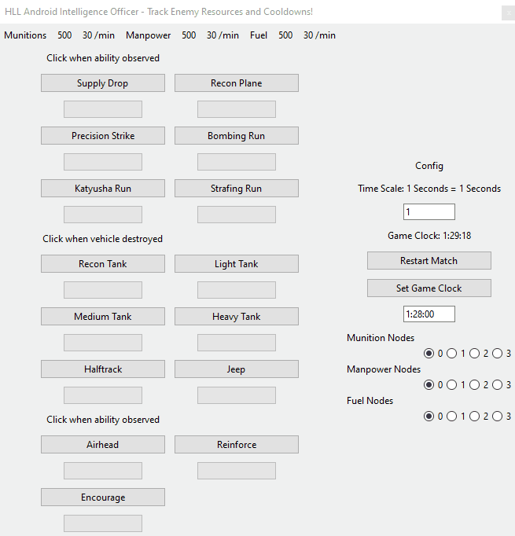

# Hell Let Loose Spy
Resource estimator and cooldown tracker for opposing team in Hell let Loose. 

## Features

* Tracks cooldowns for opposing commander's abilities
	* Press an ability button and progress bar will show time until ability can be used again
* Estimates resources for opposing commander
	* Pressing an ability button will subtract from the resource pool
	* Resources will increment as they would in game based on number of nodes set in config
	* Encourage ability will also contribute to resource accumulation by doubling node output for five minutes
* Tracks gameclock and game start
	* Restart Match button will trigger all ability cooldowns, reset resources, set game clock to 1:30:00, revive natural tank spawns.
	* Set Game Clock button will fast forward or reverse game clock to desired time and attempt to correct resource counts and cooldowns to accomodate
* Tank Commander Panel
	* Uses a "virtual commander" to estimate how many heavy tanks the enemy can have on the field. The logic is that the enemy commander will spawn heavy tanks whenever possible until they have the number they want (that number can be set in the application but default is 3). The virtual commander can't spawn a tank if it does not have enough fuel or if the cooldown is active. 
	* User helps the tool determine what the virtual commander can do by reporting when they have destroyed vehicles. Based on cooldown times, the tool can determine if a vehicle was bought using fuel or if it was a naturally spawning vehicle. (The application also shows if the medium, light, or recon natural spawns are alive or not based off cooldown times).
	* Shows if precision strike is up or not based on cooldown times.

## Disclaimer
This is not a cheat tool! This application does not interact with Hell Let Loose game files. It is basically a set of stop watches to help you remember cooldown times.

## Install/Run
* Install Python3
* Use either script HellLetLooseSpy.bat or HellLsetLoose.ps1 to launch the tool

